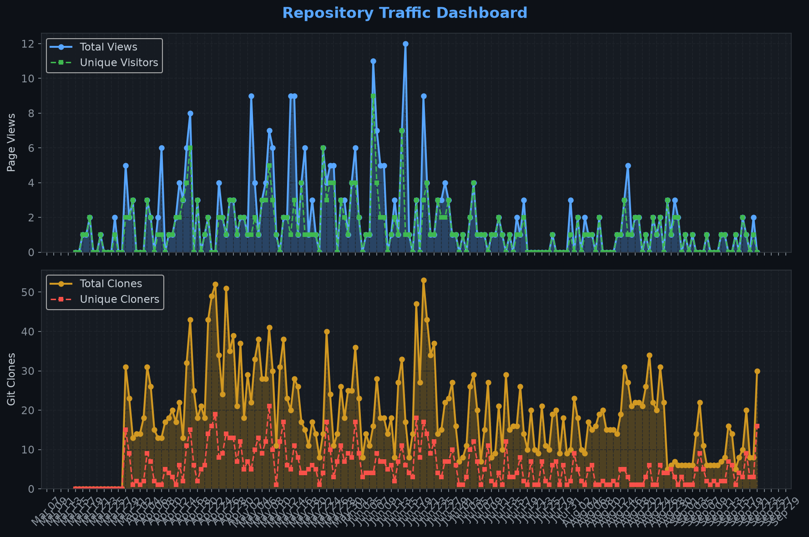
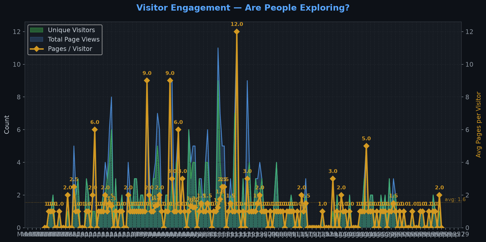
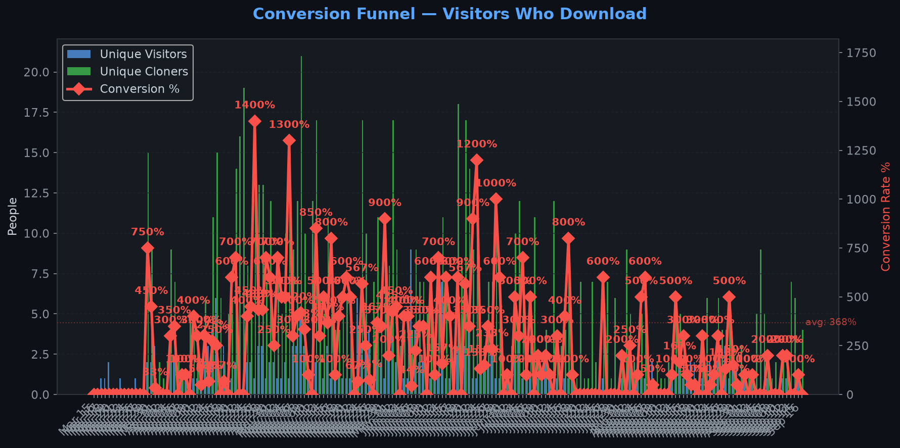
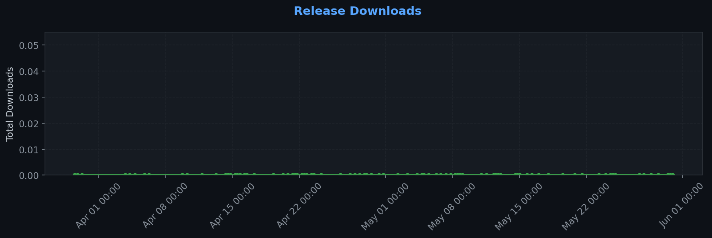
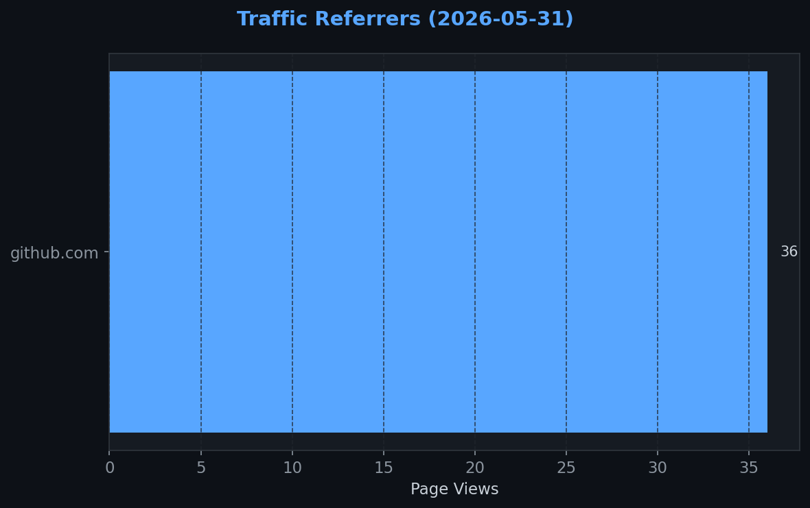
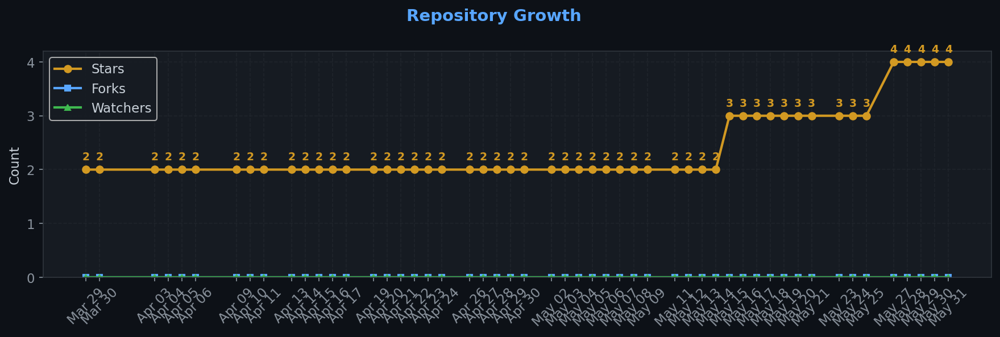

# Repository Traffic Dashboard

**Last updated:** 2026-05-31T00:07:48Z
**Days tracked:** 52 | **Download snapshots:** 84 (hourly)

---

## Views & Clones (14-day window, preserved forever)

| Metric | 14-Day Total | Unique |
|--------|-------------|--------|
| Page Views | 42 | 23 |
| Git Clones | 255 | 79 |

> **Engagement:** 1.8 pages per visitor (14-day avg)

---

## Visitor Engagement

> Higher = visitors exploring more pages. 1.0 = bounce. 3.0+ = deeply engaged.

---

## Conversion Funnel

> **14-day conversion:** 79 of 23 visitors cloned or downloaded (**343.4%**)
>
> Unique cloners: 79 | Release downloads: 0

---

## Total Acquisition per Release (Downloads + Clones)

| Channel | Count |
|---------|-------|
| Zip Downloads | 0 |
| Git Clones (14-day) | 255 |
| **Total Acquisitions** | **255** |

---

## Referrers

| Source | Views | Unique |
|--------|-------|--------|
| github.com | 36 | 22 |

---

## Repository Growth

| Metric | Current |
|--------|---------|
| Stars | 4 |
| Forks | 0 |
| Watchers | 0 |

---

## Top Pages (14-day)

| Page | Views | Unique |
|------|-------|--------|
| `/TheCodingDad-TisonK/FS25_EmployeeManager` | 36 | 23 |
| `/TheCodingDad-TisonK/FS25_EmployeeManager/commits` | 5 | 1 |
| `/TheCodingDad-TisonK/FS25_EmployeeManager/stargazers` | 1 | 1 |

---

## Data Files

| File | Description | Granularity |
|------|-------------|-------------|
| [daily.json](daily.json) | Views & clones per day (never expires) | Daily |
| [downloads.json](downloads.json) | Release download snapshots | Hourly |
| [referrers.json](referrers.json) | Referrer snapshots | Daily |
| [metadata.json](metadata.json) | Stars, forks, watchers | Daily |
| [stats.json](stats.json) | Combined legacy snapshots | 6-hourly |

---
*Hourly download tracking + full dashboard with engagement metrics every 6 hours*
*Auto-generated by [traffic-stats.yml](../../.github/workflows/traffic-stats.yml)*
